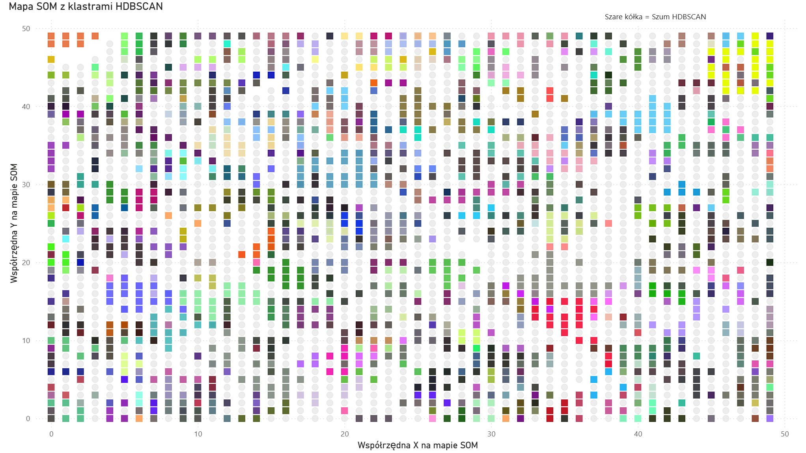
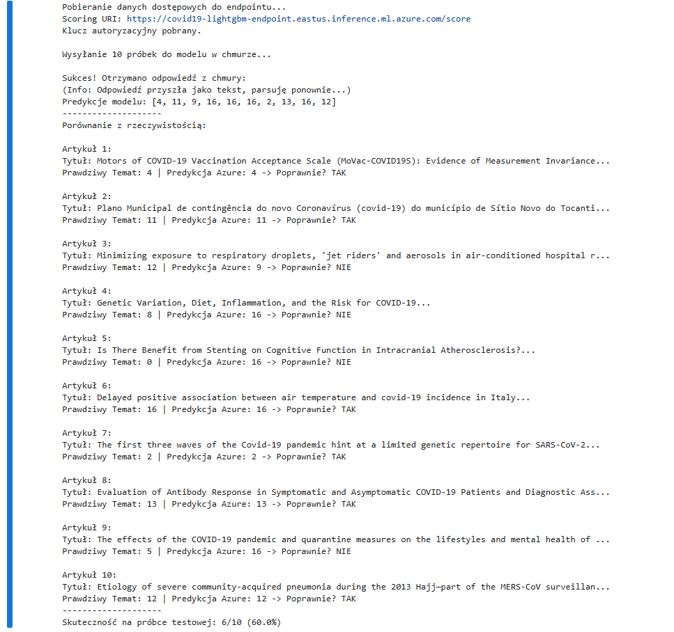
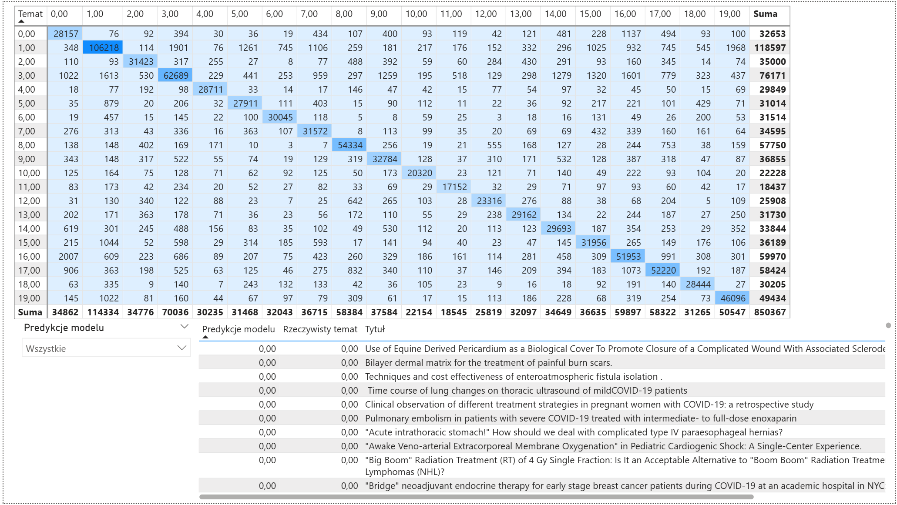
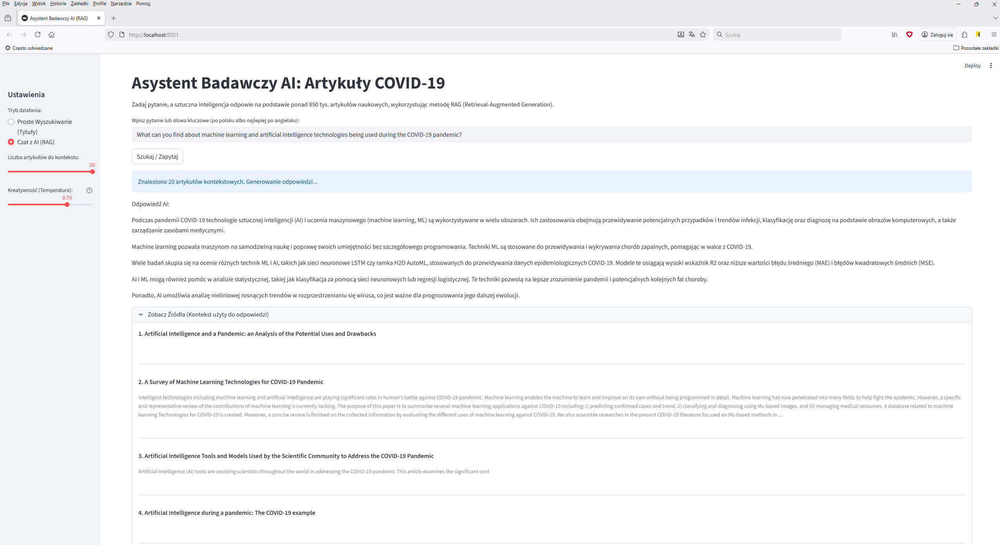

# 🦠 COVID-19 Research AI Assistant & Analytics Platform

> **Kompleksowy system Data Science i AI**, przetwarzający 850,000+ artykułów naukowych o COVID-19. Projekt łączy zaawansowane uczenie maszynowe (NLP, Clustering, Classification) z nowoczesną aplikacją webową typu RAG (Retrieval-Augmented Generation).

---

## 🚀 Live Demo

Sprawdź działającą aplikację: **[https://covid19rag.vercel.app/](https://covid19rag.vercel.app/)**

---

## 🏗️ Architektura Systemu (High-Level)

Projekt składa się z kilku zintegrowanych modułów, tworzących pełny pipeline **End-to-End**:

1.  **Frontend (React + Vite):** Nowoczesny, responsywny interfejs użytkownika hostowany na **Vercel**.
2.  **Backend (Flask):** API RESTowe hostowane na **Render**, obsługujące logikę zapytań.
3.  **AI Engine (RAG Stack):**
    - **Embeddings:** Hugging Face (SPECTER) – zamiana pytań na wektory.
    - **Vector DB:** Pinecone – przeszukiwanie bazy 850k dokumentów w milisekundy.
    - **LLM:** Groq (Llama 3.1) – generowanie odpowiedzi na podstawie znalezionego kontekstu.
4.  **Machine Learning Core:**
    - Modele Unsupervised (NMF, HDBSCAN) do odkrywania tematów.
    - Modele Supervised (LightGBM) wdrożone na **Azure ML**.
5.  **Analytics:** Dashboard Power BI zintegrowany z bazą SQL.

---

## 🧠 Data Science Journey: Od Danych do Wiedzy

Projekt przeszedł rygorystyczny proces badawczy, testując wiele hipotez i algorytmów. Poniżej przedstawiono kluczowe etapy analizy danych.

### Faza 1: Unsupervised Learning & Topic Modeling (Odkrywanie Tematów)

Celem było odkrycie ukrytych struktur w zbiorze 850k nieoznaczonych dokumentów. Przetestowano szerokie spektrum algorytmów, podejścia oparte na gęstości, grafach, faktoryzacji macierzy aż po sieci neuronowe.

|  Algorytm   |         Typ          |   Wynik    | Werdykt                                                                                                                                                      |
| :---------: | :------------------: | :--------: | :----------------------------------------------------------------------------------------------------------------------------------------------------------- |
|   **NMF**   | Matrix Factorization | ⭐⭐⭐⭐⭐ | **Zwycięzca.** Podzielił zbiór na 20 spójnych, interpretowalnych tematów. Przypisał etykietę każdemu dokumentowi (100% coverage). Użyty jako "Ground Truth". |
| **HDBSCAN** |    Density Based     |  ⭐⭐⭐⭐  | Świetny do znajdowania nisz (mikro-tematów), ale pozostawił zbyt wiele szumu (noise) nieprzypisanego do żadnej grupy.                                        |
|   **SOM**   |    Neural Network    |  ⭐⭐⭐⭐  | "Kartograf". Stworzył topologiczną mapę 2D, potwierdzając, że np. klastry HDBSCAN oraz klastry NMF sąsiadują ze sobą geometrycznie.                          |
| **Leiden**  |     Graph Based      |    ⭐⭐    | Wykrył społeczności strukturalne, ale **tematycznie niespójne** (np. łączył chemię organiczną z edukacją).                                                   |

> **Kluczowy Wniosek:** Choć algorytmy grafowe (Leiden/Louvain) są świetne do analizy cytowań, do analizy _treści_ (semantyki) najlepiej sprawdził się **NMF**. Wybrano go jako źródło etykiet ("Ground Truth") do dalszego uczenia modelu.

> 🔍 **Pełna Analiza:** Szczegółowe porównanie wszystkich testowanych algorytmów (w tym KMeans, LDA, Spectral Clustering) oraz tabela wyników znajduje się w notebooku [`covid19_20clusters.ipynb`](./covid19_20clusters.ipynb).

#### Wizualizacja Topologii Danych (Self-Organizing Maps)

Mapa SOM nałożona na tematy HDBSCAN pokazuje, że dokumenty o podobnej tematyce (np. kolory klastrów) naturalnie grupują się w sąsiednich neuronach.

---

### Faza 2: Supervised Learning (Klasyfikacja)

Wykorzystując etykiety wygenerowane przez NMF (20 tematów), wytrenowano model klasyfikacyjny, aby przewidywał tematykę nowych artykułów na podstawie ich wektorów (embeddings).

- **Cel:** Automatyczne tagowanie nowych artykułów COVID-19.
- **Modele:** Przetestowano 19 modeli (m.in. XGBoost, AdaBoost, Random Forest).
- **Zwycięzca:** `LightGBM` (Gradient Boosting Decision Tree).

**Wyniki modelu LightGBM:**

- **AUC Weighted:** `0.93` (Bardzo wysoka zdolność rozróżniania klas).
- **Accuracy:** `~58%` (Przy 20 klasach jest to wynik znacznie powyżej losowego, biorąc pod uwagę nakładanie się tematyki medycznej).

> 🔍 **Szczegółowa Analiza:** Pełne porównanie wszystkich testowanych algorytmów (w tym XGBoost, LightGBM, AdaBoost) oraz tabela wyników ich metryk znajduje się w notebooku [`covid19_supervised_learning_part2.ipynb`](./covid19_supervised_learning_part2.ipynb).

---

### Faza 3: Deployment & Analytics (Azure + Power BI)

Projekt wykroczył poza notatniki Jupyter, tworząc zintegrowane środowisko produkcyjne.

1.  **Azure Machine Learning:** Najlepszy model LightGBM został wdrożony jako REST API Endpoint na Azure.
    - _Test:_ Endpoint poprawnie klasyfikował próbki testowe (np. artykuł o szczepionkach -> Temat 4).
      Poniżej dowód poprawnego działania usługi (zapytanie JSON i odpowiedź z predykcją):

    

2.  **SQL & Power BI:**
    - Dane procesowane przez modele ML zmigrowano do bazy **SQLite**.
    - Stworzono interaktywny **Dashboard Power BI**, wizualizujący mapę SOM, macierze pomyłek i rozkład tematów NMF.

    

---

### Faza 4: Ewolucja Aplikacji (Prototypy do Produkcji)

Zanim powstała finalna wersja React/Flask, projekt ewoluował przez kilka faz prototypowania:

1.  **V1 (Lokalny RAG):** Prosta wyszukiwarka semantyczna oparta na **ChromaDB** i lokalnych skryptach.
2.  **V2 (Streamlit + LMStudio):** Interfejs czatu wykorzystujący lokalny model LLM (podłączony przez LMStudio jako serwer API).
    - _Screenshot prototypu:_ 
3.  **V3 (Final - Production):** Pełny stack **React + Flask + Pinecone + Groq**, hostowany w chmurze (Vercel/Render), dostępny publicznie.
